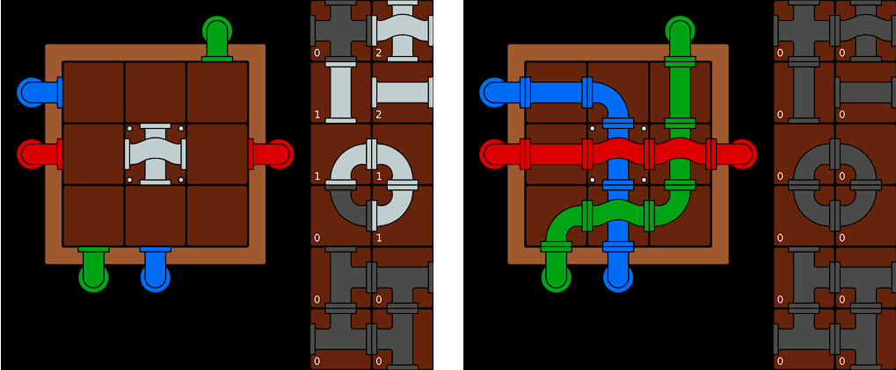
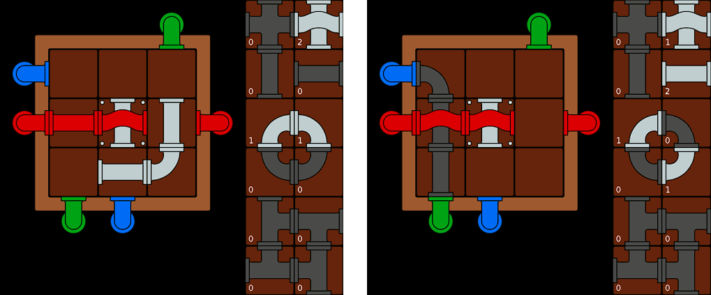
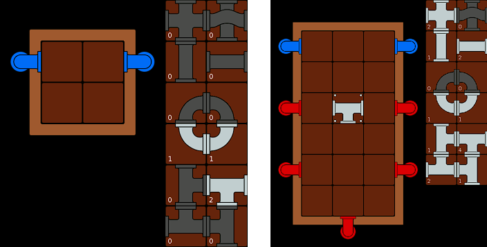
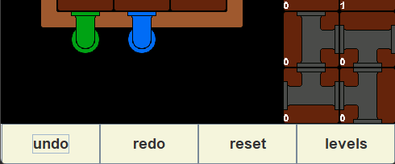
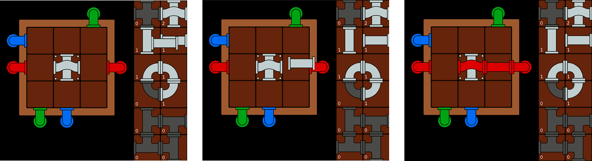
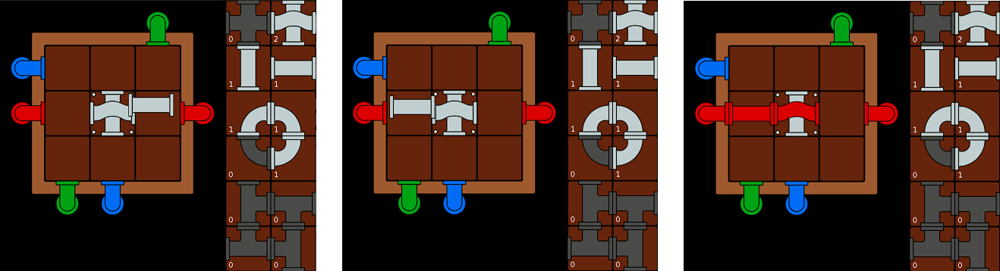
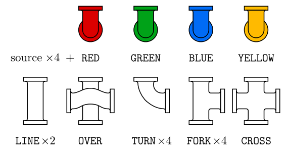
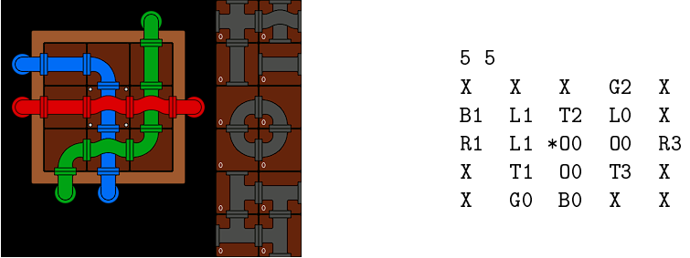

# Le jeu Plumber

Le jeu Plumber se joue sur un damier rectangulaire de taille quelconque. Sur la bordure du plateau sont disposées des sources d'eau de différentes couleurs. Le joueur dispose d'une collection de tuyaux de différentes sortes, qu'il peut librement placer sur une case vide de manière à connecter certaines des cases au bord de celle-ci. Le but du jeu est de placer tous les tuyaux de la réserve sur le plateau de manière à ce que chaque source d'eau soit connectée via une suite de composantes de tuyaux non vide à au moins une source de même couleur et à aucune de couleur différente, et qu'aucune composante de tuyau connectée à au moins une source ne soit aussi connectée à un espace vide.

Dans les figures ci-dessous, les couleurs sont celles affichées par le jeu. La première image montre la configuration initiale du plateau de taille 3 × 3 proposé au joueur. Sur sa partie droite se trouvent les 12 sortes de tuyaux possibles du jeu, avec pour chaque sorte une indication du nombre d'exemplaires de ce tuyau proposées au joueur. Le tuyau de la case centrale, formé de deux composantes reliant deux à deux les bords opposés de cette case, est vissé au plateau et ne peut être déplacé. La seconde image montre l'unique solution de cette configuration initiale.

  

Les deux images suivantes montrent deux étapes du jeu dans un état intermédiaire. Dans la première, les composantes de tuyaux connectées à une source sont affichées de la couleur de celle-ci, celles qui ne sont connectées à aucune source étant affichées d'une couleur neutre. Dans la seconde, deux sources de couleurs différentes, bleu et vert, sont connectées entre elles : les composantes de tuyaux connectées aux deux sources sont affichées d'une couleur singulière indiquant au joueur qu'il est nécessaire de les déconnecter. Noter que les éléments épuisés ou initialement absents à droite de chaque image sont aussi d'une couleur singulière.

  

# L'écran de jeu

L'écran d'accueil du programme permet de sélectionner un niveau parmi un ensemble de niveaux numérotés par de simples entiers. Une fois un niveau choisi, cet écran sera remplacé par un écran de jeu, affichant dans deux zones distinctes le plateau de jeu dans la configuration initiale de ce niveau, et la réserve de tuyaux.

Le plateau de jeu comporte des zones cliquables pour pouvoir, y placer des tuyaux depuis la reserve, déplacer des tuyaux, prédémément placé, dans la réserve ou sur un entre emplacement valide du plateau.

La réserve comporte 12 zones cliquables, une pour chaque sorte de tuyau. Elle indique en permanence le nombre de tuyaux de chaque sorte encore disponibles, et indique de manière visuellement claire que ce nombre est nul sans avoir à lire sa valeur.

Les dimensions de l'écran de jeu n'excédent pas des valeurs maximales choisies de manière à ce qu'il ne recouvre pas une trop grande portion de l'écran de la machine. L'échelle d'affichage est adaptée de manière à respecter cette contrainte. Par exemple, les portions d'écrans de jeu ci-dessous ont la même hauteur en nombre de pixels : la taille des éléments a été réduite à droite afin de respecter cette contrainte :

  

L'écran de jeu contient également : un bouton permettant de revenir à l'ecran d'accueil, deux boutons permettant de défaire ou de rétablir les derniers déplacements valides de tuyaux, et un bouton permettant de revenir à la configuration initiale du niveau.

  

# Règles de coloration des composantes

A chaque instant du jeu, les sources sont affichées de leur couleur. Une composante de tuyau qui n'est connecté à aucune source est affiché d'une couleur neutre. Si une composante est connectée à au moins une source, et si toutes les sources auxquelles elle est connectée sont de même couleur, cette composante est affichée de cette couleur. Enfin, si une source est connectée à une source de couleur différente, toutes les composantes auxquelles elle est connectée sont affichées d'une couleur singulière.

# Déplacements de tuyaux

Les tuyaux non vissés sont transférés par drag and drop de la réserve vers une case vide du plateau, d'une case du plateau vers une autre case vide, ou encore être écartés du plateau et automatiquement remis dans la réserve. Voici l'interaction avec l'interface permettant d'effectuer la première catégorie d'actions, ainsi que le comportement attendu de l'interface :

    1. L'utilisateur clique dans une zone de la réserve associée à une sorte de tuyau dont il reste encore au moins un exemplaire, et maintient le bouton de la souris. Un tuyau est extrait de la réserve et apparaît sous son pointeur. Ce tuyau suivra le pointeur pendant toute la durée du geste de l'utilisateur.
    2. Il relâche le bouton de la souris au dessus d'une case vide.
    3. Le tuyau est automatiquement déplacé par mouvement rectiligne et continu depuis sa position courante jusqu'à sa position centrale dans la case, et est ajouté au plateau à la fin de ce déplacement.

Visuellement :

  

La seconde catégorie se décrit de manière similaire :

    1. L'utilisateur clique sur une case du plateau contenant un tuyau et maintient le bouton de la souris. Le tuyau est extrait du plateau et suivra le pointeur pendant toute la durée du geste.
    2. Il relâche le bouton de la souris au dessus d'une case vide.
    3. Le tuyau est automatiquement déplacé par mouvement rectiligne et continu depuis sa position courante jusqu'à sa position centrale dans la case, et est ajouté au plateau à la fin de ce déplacement.

Les figures suivantes illustrent ces trois étapes :

  

Il est évidemment interdit de déplacer une source, ou d'extraire de la réserve un tuyau dont il ne reste aucun exemplaire.
Le cas où, comme-ci dessus, l'utilisateur extrait un tuyau du plateau ou de la réserve mais termine son geste au dessus
d'une zone de l'écran qui n'est pas une case vide, se gère de la manière suivante :

    1. Si l'utilisateur termine son geste à l'extérieur du plateau, le tuyau revient automatiquement par mouvement
    rectiligne et continu vers sa zone associée dans la réserve, et est remis dans la réserve à la fin ce déplacement.
    2. Si le tuyau a été extrait du plateau mais relaché sur une case non vide, il revient automatiquement par mouvement
    rectiligne et continu vers sa case d'origine, et est remis dans cette case à la fin de ce déplacement.

Le retour d'un tuyau vers son emplacement initial n'est pas considéré comme un déplacement dans l'historique du jeu : seuls les déplacements de la réserve vers le plateau, du plateau vers la réserve ou d'une case vers une autre case peuvent être annulés ou rétablis.

# Fichiers de niveaux

A rotation près, il n'y a qu'une seule source de quatre couleurs possibles, que nous appellerons RED, GREEN BLUE, YELLOW, et cinq sortes de tuyaux que nous appellerons LINE, OVER, FORK, et CROSS. Un tuyau ou une source peut être tourné de 90 degrés vers la droite 1, 2 ou 4 fois avant de retrouver sa fonctionnalité d'origine. La figure ci-dessous montre ces éléments dans ce que nous considérerons comme leur orientation par défaut :

  

Un fichier de niveau est un fichier texte dont le nom est de la forme "level num.p" où num est le numéro du niveau. Il est structuré de la manière suivante :

	* Le fichier commence par deux entiers h w, suivis de h × w chaînes séparées par des espacements. Ces chaînes spécifient d'une part le contenu du plateau dans une configuration gagnante, d'autre part le contenu de sa bordure - le plateau contient (h−2)×(w −2) cases, sa bordure contient 4 coins et (2×h) + (2×w) emplacements faisant face à une case, donc pouvant contenir une source.
	* La chaîne "X" spécifie un élément de bordure vide. Une chaîne commençant par R, G, B ou Y spécifie sur la bordure la présence d'une source dont la couleur a ce caractère comme première lettre.
	* La chaîne "." spécifie qu'une case du plateau est vide. Une chaîne commençant par L, O, T F ou C, éventuellement précédé du caractère *, spécifie sur une case du plateau la présence d'un tuyau ayant ce caractère comme première lettre. La présence d'une étoile indique que le tuyau est vissé au plateau.
	* Un caractère R, G, B, Y, L, O, T F C dans une chaîne est immédiatement suivi de 0 (zéro), 1, 2 ou 3. Ce nombre indique, pour une source ou un tuyau, le nombre de rotations d'un quart de tour vers la droite que doit subir cet élément dans son orientation par défaut pour atteindre son orientation dans la solution du niveau.

Voici par exemple le contenu du fichier encodant le niveau présenté dans l'introduction :

  

Le choix d'un niveau dans l'écran d'accueil sera suivi de la lecture du fichier de niveau associé, afin de reconstruire en mémoire une configuration gagnante du niveau. Les tuyaux non vissés seront simplement transférés dans une réserve initialement vide avant que l'écran de jeu ne soit proposé au joueur.